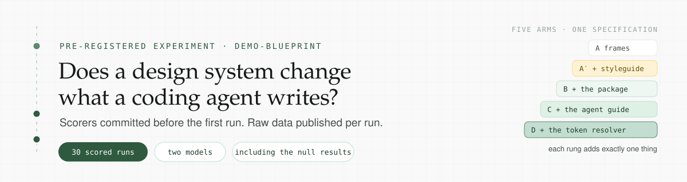
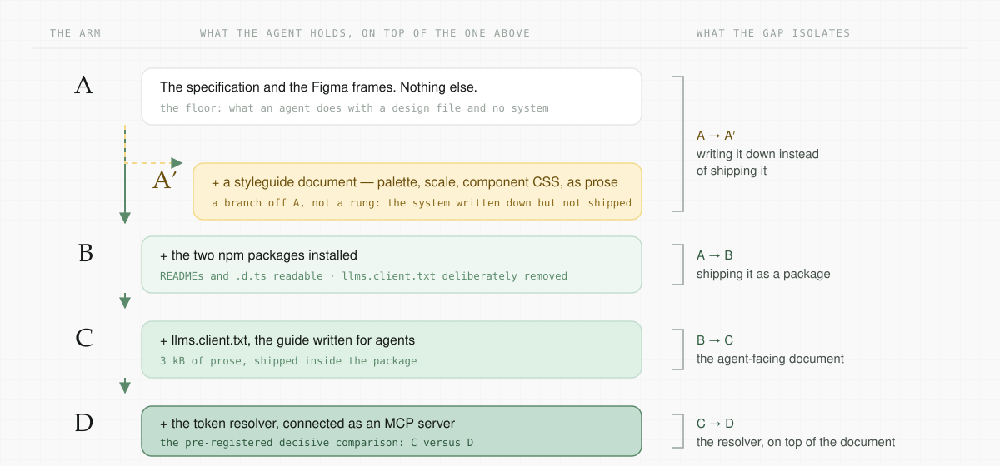

<p align="center">
  
</p>

<p align="center">
  
  
  
  
  
  <a href="https://github.com/jablonowski/design-system-blueprint"></a>
</p>

---

One specification, one application, five levels of infrastructure, and a set of scorers
committed before the first run. Every run is reduced the same way, and every record is
published — the comparisons that supported this repository's premise and the ones that
did not.

The design system under test is
[**design-system-blueprint**](https://github.com/jablonowski/design-system-blueprint) — a
three-tier token pipeline, an Angular component library, machine-readable contracts for
agents, and npm publishing.

> **Status: stage one complete, the study continues.** Thirty-five scored runs — five arms at
> n = 5 on Claude Opus, the same five at n = 2 on Claude Sonnet. Drift and
> cost-per-accepted-screen are still open; arms A′ and C each have three Opus runs taken
> outside the round structure, and the Sonnet rounds were never one sitting; the convention
> grid dropped from eight checks to seven on 2026-10-07; and the second Sonnet round withdrew
> two claims that had rested on a single run. All of it is in the protocol.
>
> **Numbers here, readings elsewhere.** This README and [`docs/results.md`](docs/results.md)
> carry the data. The interpretation lives in [`eval/PROTOCOL.md`](eval/PROTOCOL.md), kept
> apart on purpose so the two can be checked against each other.

## The design

<p align="center">
  
</p>

Every run is one specification plus one overlay, handed to a fresh agent session in an empty
directory outside any repository. The specification is byte-identical across arms and names
zero component names and zero design values. Only the overlay differs, and each rung adds
exactly one thing — which is what makes the gaps readable.

The design data reaches every arm through a **recorded** Figma channel, so all thirty runs
received byte-identical frames.

→ [The method in full](docs/method.md) · [What was pre-registered](docs/pre-registration.md)

## Headline numbers

Claude Opus, median of five runs per arm. Full per-run tables — thirty-five runs, every
metric, both models — are in **[`docs/results.md`](docs/results.md)**.

| | A | A′ | B | C | D |
|---|---|---|---|---|---|
| Library components used (of 13) | 0 | 0 | 13 | 13 | 13 |
| Components hand-reimplemented | 12 | 13 | 0 | 0 | 0 |
| Scattered raw values | 4 | **138** | 0 | 0 | 0 |
| Custom properties the app now owns | 90 | 27 | 0 | 0 | 0 |
| Decision tokens used | 0 | 0 | 60 | 59 | 59 |
| Convention checks passed (5 runs × 7) | n/a | n/a | 31/35 | 35/35 | 35/35 |
| axe violations — serious | 3 | 2 | 0 | 0 | 0 |
| Hallucinated API references | 0 | 0 | 0 | 0 | 0 |
| Cost, median | $2.29 | $2.02 | $3.19 | $2.83 | $3.04 |

`n/a` is not a pass: the seven convention checks are all about the component library's API,
so they do not apply to an arm that has no library.

→ [What each column counts, and what it would fail to notice](docs/scorers.md)

## Documentation

### → **[Go to the docs](docs/start.md)**

| | |
|---|---|
| [Results](docs/results.md) | Every run, every metric, both models — plus the per-check grid and the contrast table |
| [Method](docs/method.md) | The arms, the specification, the recorded design channel, rounds |
| [Pre-registration](docs/pre-registration.md) | The falsifier and the predictions, recorded before the runs |
| [Scorers](docs/scorers.md) | What each column counts and the judgements baked into it |
| [Limitations](docs/limitations.md) | What is excluded, what is void, and what is not claimed |
| [A note on the instrument](docs/instrument.md) | Twelve times a gate reported on the wrong proposition |
| [Running it](docs/running-it.md) | Commands, repository layout, what a run needs |

And, kept whole rather than split: **[`eval/PROTOCOL.md`](eval/PROTOCOL.md)** — the
pre-registration, every rule that changed mid-study with what the change cost, every
discarded run, and the readings. Its value is that it is one chronological document and
nothing has been removed from it.

## Quick start

```bash
cd eval
npm install
./run.sh preflight        # credentials, flags, and the recorded design channel
./run.sh round 1          # run 1 of every arm, in one sitting
node score.js --all       # reduce every archived run to a row
```

Requires a Claude Code credential. The design channel is a committed recording, so no Figma
token is needed to run the experiment — only to re-record it.

→ [All the commands](docs/running-it.md)

## Related

- [**design-system-blueprint**](https://github.com/jablonowski/design-system-blueprint) —
  the design system under test
- `@jablonowski/dsb-tokens`, `@jablonowski/dsb-components`, `@jablonowski/dsb-tokens-mcp` on npm

---

⭐ Built in the open, null results included. Give it a ⭐ if it is useful 😊

By [Mateusz Jabłonowski](https://jablonowski.eu). Part of broader research :)
