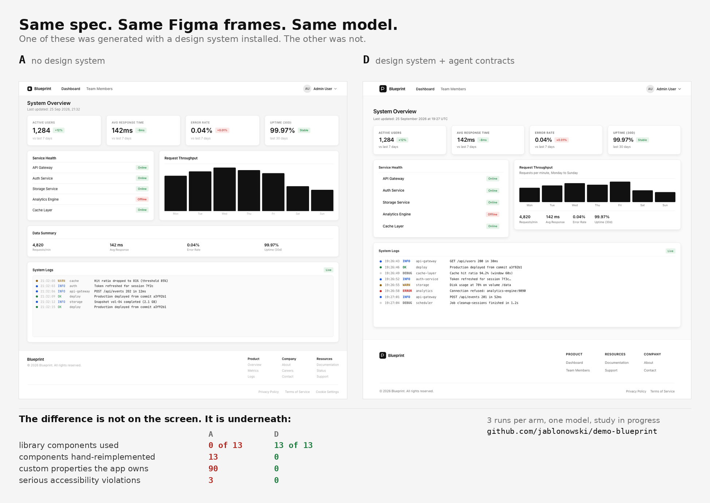

# Results

[← docs index](start.md) · [README](../README.md)

Every scored run, both models. The README carries a median-per-arm summary; this is the
whole table. Readings are deliberately not here — they are in
[`eval/PROTOCOL.md`](../eval/PROTOCOL.md).

Two models, thirty scored runs, identical specification and identical design data in every
one. Per-run records: [`eval/results/`](../eval/results) — one `<arm>-<n>.json` with the harness
record and one `<arm>-<n>.score.json` with every metric and its detail. The generated
applications and their screenshots are in [`eval/runs/`](../eval/runs).

### Claude Opus, n = 5 per arm

| Metric | A-1 | A-2 | A-3 | A-4 | A-5 | A′-1 | A′-2 | A′-3 | A′-4 | A′-5 | B-1 | B-2 | B-3 | B-4 | B-5 | C-1 | C-2 | C-3 | C-4 | C-5 | D-1 | D-2 | D-3 | D-4 | D-5 |
|---|---:|---:|---:|---:|---:|---:|---:|---:|---:|---:|---:|---:|---:|---:|---:|---:|---:|---:|---:|---:|---:|---:|---:|---:|---:|
| Library components used (of 13) | 0 | 0 | 0 | 0 | 0 | 0 | 0 | 0 | 0 | 0 | 13 | 13 | 13 | 13 | 13 | 13 | 13 | 13 | 13 | 13 | 13 | 13 | 13 | 13 | 13 |
| Components hand-reimplemented | 13 | 12 | 12 | 12 | 12 | 13 | 13 | 13 | 13 | 13 | 0 | 0 | 0 | 0 | 0 | 0 | 0 | 0 | 0 | 0 | 0 | 0 | 0 | 0 | 0 |
| Scattered raw values | 6 | 0 | 0 | 6 | 4 | 139 | 132 | 133 | 146 | 138 | 0 | 0 | 0 | 0 | 0 | 0 | 0 | 0 | 0 | 0 | 0 | 2 | 0 | 0 | 2 |
| Custom properties declared locally | 90 | 99 | 91 | 89 | 88 | 28 | 27 | 27 | 27 | 27 | 0 | 0 | 0 | 6 | 0 | 0 | 0 | 0 | 0 | 0 | 0 | 0 | 2 | 0 | 0 |
| Tier boundary crossings | 0 | 0 | 0 | 0 | 0 | 0 | 0 | 0 | 0 | 0 | 0 | 0 | 0 | 0 | 0 | 0 | 0 | 0 | 0 | 0 | 0 | 0 | 0 | 0 | 0 |
| Design-system decision tokens used | 0 | 0 | 0 | 0 | 0 | 0 | 0 | 0 | 0 | 0 | 60 | 57 | 60 | 62 | 56 | 61 | 62 | 59 | 59 | 59 | 77 | 56 | 59 | 58 | 59 |
| Hallucinated API references | 0 | 0 | 0 | 0 | 0 | 0 | 0 | 0 | 0 | 0 | 0 | 0 | 0 | 0 | 0 | 0 | 0 | 0 | 0 | 0 | 0 | 0 | 0 | 0 | 0 |
| Convention checks passed (of 7) | n/a | n/a | n/a | n/a | n/a | n/a | n/a | n/a | n/a | n/a | 6 | 7 | 6 | 6 | 6 | 7 | 7 | 7 | 7 | 7 | 7 | 7 | 7 | 7 | 7 |
| Values authored by the run | 96 | 99 | 91 | 95 | 92 | 167 | 159 | 160 | 173 | 165 | 0 | 0 | 0 | 6 | 0 | 0 | 0 | 0 | 0 | 0 | 0 | 2 | 2 | 0 | 2 |
| Colour conformance rate | 0.91 | 0.85 | 0.79 | 0.84 | 0.94 | 0.57 | 0.64 | 0.57 | 0.64 | 0.59 | — | — | — | 1.00 | — | — | — | — | — | — | — | — | — | — | — |
| Conformance rate, overall | 0.92 | 0.88 | 0.85 | 0.86 | 0.92 | 0.87 | 0.88 | 0.86 | 0.87 | 0.87 | — | — | — | 1.00 | — | — | — | — | — | — | — | 1.00 | 0.50 | — | 0.00 |
| Near-miss values | 2 | 2 | 3 | 3 | 2 | 11 | 9 | 10 | 9 | 10 | 0 | 0 | 0 | 0 | 0 | 0 | 0 | 0 | 0 | 0 | 0 | 0 | 0 | 0 | 0 |
| axe violations — serious | 3 | 3 | 3 | 3 | 3 | 2 | 2 | 2 | 2 | 3 | 0 | 0 | 0 | 0 | 0 | 0 | 0 | 0 | 0 | 0 | 0 | 0 | 0 | 0 | 0 |
| axe violations — critical | 0 | 0 | 0 | 0 | 0 | 0 | 0 | 0 | 0 | 0 | 0 | 0 | 0 | 0 | 0 | 0 | 0 | 0 | 0 | 0 | 0 | 0 | 0 | 0 | 0 |
| Builds | yes | yes | yes | yes | yes | yes | yes | yes | yes | yes | yes | yes | yes | yes | yes | yes | yes | yes | yes | yes | yes | yes | yes | yes | yes |
| Cost (USD) | 2.06 | 2.54 | 2.17 | 2.64 | 2.29 | 2.19 | 2.11 | 2.02 | 1.98 | 1.88 | 3.20 | 3.19 | 2.82 | 3.61 | 2.92 | 3.13 | 2.69 | 2.83 | 2.76 | 3.43 | 3.15 | 2.88 | 2.86 | 3.05 | 3.04 |

### Claude Sonnet, n = 1 per arm

| Metric | A-1 | A′-1 | B-1 | C-1 | D-1 |
|---|---:|---:|---:|---:|---:|
| Library components used (of 13) | 0 | 0 | 13 | 13 | 12 |
| Components hand-reimplemented | 13 | 13 | 0 | 0 | 1 |
| Scattered raw values | 46 | 117 | 17 | 5 | 2 |
| Custom properties declared locally | 71 | 27 | 0 | 0 | 0 |
| Tier boundary crossings | 0 | 0 | 2 | 0 | 0 |
| Design-system decision tokens used | 0 | 0 | 49 | 54 | 58 |
| Hallucinated API references | 0 | 0 | 0 | 0 | 0 |
| Convention checks passed (of 7) | n/a | n/a | 5 | 6 | 6 |
| Values authored by the run | 117 | 144 | 17 | 5 | 2 |
| Colour conformance rate | 0.73 | 0.69 | 1.00 | — | — |
| Conformance rate, overall | 0.83 | 0.86 | 0.94 | 0.40 | 0.50 |
| Near-miss values | 10 | 9 | 0 | 0 | 0 |
| axe violations — serious | 3 | 2 | 1 | 0 | 0 |
| axe violations — critical | 0 | 0 | 0 | 0 | 0 |
| Builds | yes | yes | yes | yes | yes |
| Cost (USD) | 4.75 | 4.18 | 6.63 | 7.21 | 8.82 |

### Which convention checks failed, run by run

Claude Opus, all fifteen runs that held the library. Every check applied in every run; there
is no `n/a` in this grid.

| | B-1 | B-2 | B-3 | B-4 | B-5 | C-1 | C-2 | C-3 | C-4 | C-5 | D-1 | D-2 | D-3 | D-4 | D-5 |
|---|---|---|---|---|---|---|---|---|---|---|---|---|---|---|---|
| `9.2` `#cell` + `let-row="row"` | **fail** | pass | **fail** | **fail** | **fail** | pass | pass | pass | pass | pass | pass | pass | pass | pass | pass |
| all other checks | pass | pass | pass | pass | pass | pass | pass | pass | pass | pass | pass | pass | pass | pass | pass |

On Sonnet, one run per arm: B fails `9.2` and returns `n/a` on `9.4`; C returns `n/a` on
`9.4`; D returns `n/a` on `9.3`. No other check failed on either model.

The grid had an eighth check, `9.6`, until 2026-10-07. It asked whether a split modal footer
set `flex:1` on the projected element, and it returned `n/a` whenever the run had not built
one — five of the fifteen Opus runs above, spread across all three arms. It was removed
because it reported on what the agent chose to build rather than on what it knew about the
component API, and because that `n/a` pattern was producing an apparent C-versus-D difference
that does not exist. The reasoning is in
[`eval/PROTOCOL.md`](../eval/PROTOCOL.md); the definition is in git history.

### Which routes failed a contrast check

`color-contrast` is the only `serious` rule that fired anywhere in the study, except one
`aria-prohibited-attr` on Sonnet B-1.

| | /login | /dashboard | /users |
|---|---|---|---|
| **A** — Figma frames only, 6 runs | fail | fail | fail |
| **A′** — plus a styleguide document, 5 runs | pass | fail | fail |
| **A′** — plus a styleguide document, 1 run (Opus A′-5) | fail | fail | fail |
| **B, C, D** — the library, 18 runs | pass | pass | pass |

`/login` carries no status tags; `/dashboard` and `/users` do. The tag colours are prescribed
by A′'s styleguide and three of the four pairings miss WCAG AA — `#16a34a` on `#f0fdf4` at
3.15:1, `#ca8a04` on `#fefce8` at 2.84:1, `#dc2626` on `#fef2f2` at 4.41:1.

The same styleguide also defines `--color-text-muted: #999999`, which reaches 2.50:1 to 2.85:1
against the four surfaces the document itself defines and so passes AA on none of them. Five
of the six A′ runs used `--color-text-secondary` on the login screen and one used `muted`;
that single choice is the whole difference between the two A′ rows above.

`n/a` is not a pass. The seven checks are all about the component library's API, so they do
not apply to an arm that has no library. The conformance rate is computed only over values the
run authored itself, so for the library arms — which authored between 0 and 17 — it is a
ratio over a handful of observations and is not comparable with A and A′, which authored 71
to 96. The authored count is in the tables above so that every rate can be read with its
denominator.

### Screenshots

Every run's screens as the harness rendered them, at 1280px and 390px:
[`eval/runs/<model>/<arm>-<n>/shots/`](../eval/runs). Login, dashboard and users table for each
run, captured in the same pass that runs axe.

