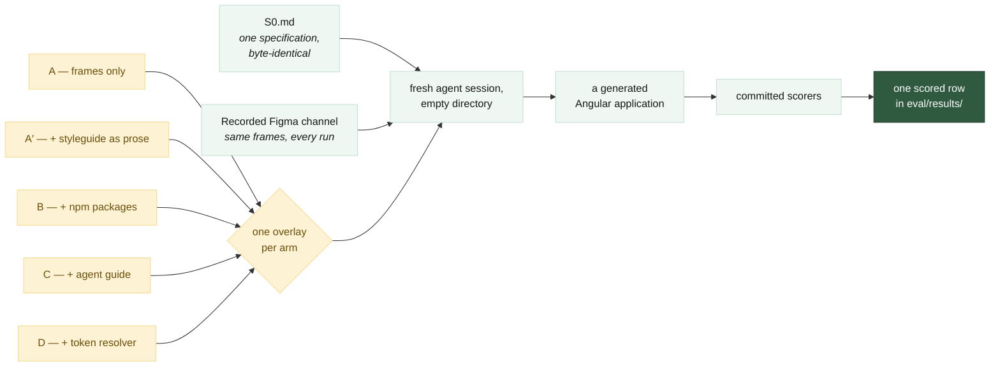

# Documentation

[← back to the README](../README.md)

Seven documents, plus the protocol. The README carries the design and the headline numbers;
everything below is the detail behind them.

## What the experiment does

Everything in green is held constant across all thirty runs. Everything in yellow is the
one variable. The drawn version of the arms is
[`assets/arms.svg`](assets/arms.svg).

## The documents

### The data

- **[Results](results.md)** — thirty runs, every metric, both models. The per-check grid,
  the contrast table, and where the screenshots live.
- **[Scorers](scorers.md)** — what each column counts, which scorer produces it, and what
  it would fail to notice.

### How it was run

- **[Method](method.md)** — the five arms and what each adds, the specification, why the
  design channel is a recording, and what a round is.
- **[Pre-registration](pre-registration.md)** — the falsifier and the predictions, recorded
  before any run, including the ones that failed.
- **[Running it](running-it.md)** — the commands, the repository layout, what a run needs.

### What to distrust

- **[Limitations](limitations.md)** — what is excluded, what is void, and the list of things
  this study does not claim.
- **[A note on the instrument](instrument.md)** — eleven times a gate reported success while
  proving a different proposition than the one it was written for. Each one was green.

### The audit trail

- **[`eval/PROTOCOL.md`](../eval/PROTOCOL.md)** — deliberately not split. The
  pre-registration, the dated log of every rule that changed and what the change cost, every
  discarded run, and the readings. It is one chronological document and nothing has been
  removed from it; that is the whole of its value.
- **[`eval/SCORERS.md`](../eval/SCORERS.md)** — the judgements baked into each metric: the
  tolerances, the thirteen slots, the exclusions.

## Related

The system under test:
[design-system-blueprint](https://github.com/jablonowski/design-system-blueprint) — its own
docs explain how the three tiers, the component library and the agent contracts are built.
